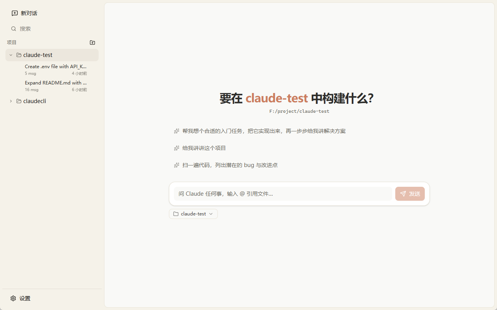
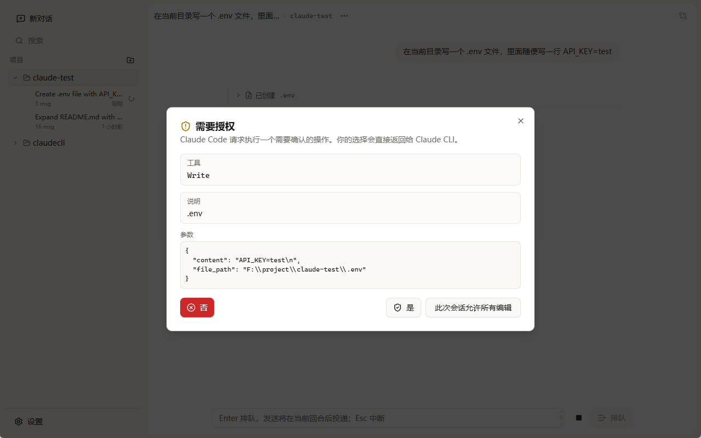

<h1 align="center">Claudinal</h1>

<p align="center">
  
</p>

<p align="center">
  一个为 Claude CLI 量身定制的高颜值桌面外壳。
</p>

<p align="center">
  <a href="https://github.com/ccpopy/claudinal/releases">
    
  </a>
  <a href="https://github.com/ccpopy/claudinal/blob/main/LICENSE">
    
  </a>
  
  
  
  
</p>

**核心理念：不重新发明 Agent，只打造一个比 TUI 更好用的桌面外壳。**
本项目通过 Tauri 2 封装本地 `claude` CLI 的 headless stream-json 接口，底层的 Prompt 处理、工具调度与 Hook 执行完全交由原生 Claude CLI 负责。CLI 一经升级，桌面端即刻自动获得新能力。

## 特别感谢

<div align="center">

### [Linux.do](https://linux.do/)

**LinuxDo 社区**

真诚、友善、团结、专业，共建你我引以为荣之社区。

### [Trellis](https://github.com/mindfold-ai/trellis)

**The best agent harness**

让团队规模的 AI 编码更可靠：围绕渐进式规范、任务上下文、自定义工作流和跨 Agent 记忆构建的 Agent harness。

</div>

## 界面预览

### 主界面

<p align="center">
  
</p>

### 权限确认

<p align="center">
  
</p>

## ✨ 核心特性

- **极致的流式渲染**：沉浸式的 Markdown 对话体验，逐字渲染，平滑过渡。
- **Codex 风格会话管理**：清晰的本地项目分组、历史对话恢复、置顶、归档、删除与 SQLite 元数据缓存。
- **参数可视化控制**：在 Composer 中调节 Model / Effort / Permission Mode，并按会话保存偏好。
- **结构化消息卡片**：告别杂乱的终端输出，思考过程 (Thinking)、工具调用 (Bash/Edit/Read) 均采用独立、优雅的折叠卡片与 Diff 视图展示。
- **原生能力加持**：无缝支持系统文件拖拽粘贴、本地代理设置及深浅色主题自由切换。

## 🛠️ 技术栈

- **外壳与后端**：Tauri 2 + Rust (子进程管理 + jsonl 读取 + SQLite 元数据缓存)
- **前端界面**：React 19 + TypeScript + useReducer
- **UI 框架**：shadcn/ui + Tailwind CSS v4 + lucide-react

## 🚀 快速开始

### 前置要求

1. 本地已安装并配置好官方的 `claude` CLI（≥ 2.1.123）。
2. Node.js 及 `pnpm` 包管理器。
3. Rust 编译环境。

### 本地运行

```bash
# 克隆仓库
git clone https://github.com/ccpopy/claudinal.git
cd claudinal

# 安装依赖
pnpm install

# 启动开发环境
pnpm tauri dev
```

### 打包构建

```bash
# 各平台打包 (自动检测当前系统)
pnpm tauri build

# --- Windows ---
pnpm package:exe          # NSIS 安装包 (.exe)
pnpm package:msi          # MSI 安装包
pnpm package:win          # 同时打包 NSIS + MSI

# --- macOS ---
pnpm package:dmg          # DMG 镜像
pnpm package:mac-app      # .app 包
pnpm package:mac          # .app + DMG
pnpm package:mac-universal # Universal Binary (.app + DMG)

# --- Linux ---
pnpm package:deb          # Debian/Ubuntu (.deb)
pnpm package:rpm          # RedHat/Fedora (.rpm)
pnpm package:appimage     # AppImage 便携包
pnpm package:linux        # 同时打包 deb + rpm + AppImage

# 打包为便携版 zip (跨平台)
pnpm package:zip          # 全平台 zip
pnpm package:zip-installer  # 仅安装版 zip
pnpm package:zip-portable   # 仅便携版 zip
```

### 自动发布

推送和版本号一致的 tag 会自动触发 GitHub Release 打包：

```bash
git tag v0.1.1
git push origin v0.1.1
```

Workflow 会校验 `package.json` 与 `src-tauri/tauri.conf.json` 的版本号，然后在 Windows、macOS 和 Linux runner 上分别构建安装包，并上传源码包与 `SHA256SUMS.txt`。

## 📜 协议

本项目采用 **GNU AGPLv3** 开源协议。

- 个人、学术及商业使用均免费。
- 修改或衍生作品必须以 AGPLv3 协议开源。
- 网络部署须向用户提供完整源码。
- 禁止在闭源商业产品中嵌入本项目代码。
